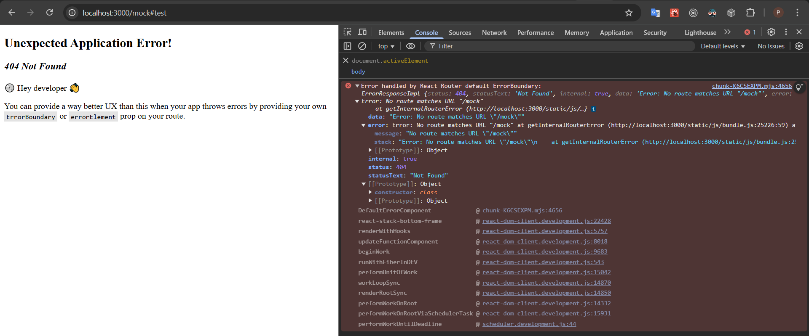

# Fragment (hash) bug replication repo

### Run the app locally:

`npm i`

`npm start`

### Reproduce the issue:

1. Enter `http://localhost:3000/` in the browser.
2. Go to `http://localhost:3000/mock`.
3. Refresh the page and observe the navigation working as expected.
4. Add fragment to the URL (`http://localhost:3000/mock#test`).
5. Refresh the page and observe the `404 Not Found` router error.

### Effect:

